<div class="flex items-center gap-4 max-w-max mx-auto">
  
  <h1>Tailscale</h1>
</div>

VPN peer-to-peer, cifrado E2E y zero-config

---

# Contenido

1. El problema de las VPN tradicionales
2. Wireguard
3. Arquitectura de Tailscale
4. Casos de uso
5.

---

# El problema de las VPN tradicionales

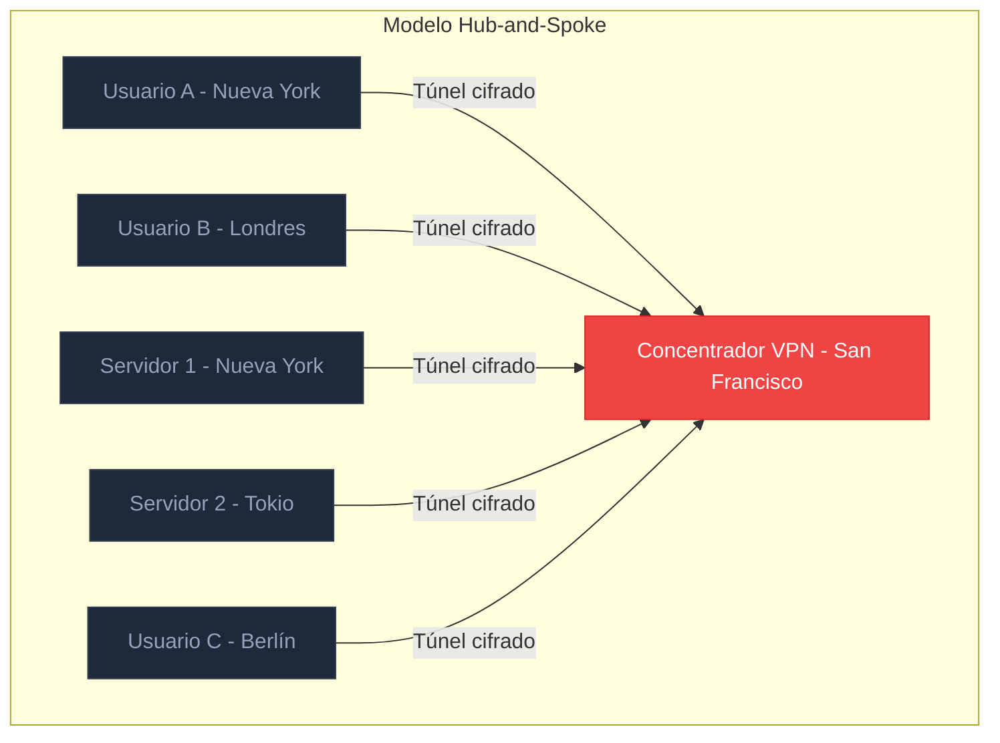

<v-clicks>

- Todo el tráfico pasa por un <span v-mark.red="1">único</span> punto central
- El usuario en NY accediendo al servidor en NY viaja a SF ida y vuelta
- Si el concentrador cae, **toda la red cae**

</v-clicks>

---

# VPN Mesh Completa: La Alternativa Costosa

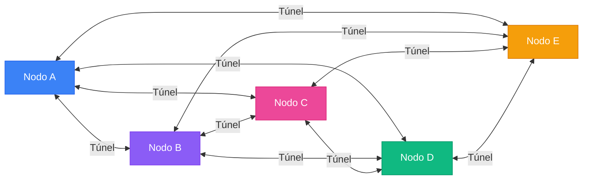

<div class="grid grid-cols-2 gap-8 mt-4">
  <div v-click>
    <h3 class="text-red-400 mb-2">Problema de escala</h3>
    <div class="p-3 bg-gray-900/50 rounded border border-gray-800" >
      <div>10 nodos = <span class="text-red-400 font-bold">45 túneles</span></div>
      <div>100 nodos = <span class="text-red-400 font-bold">4950 túneles</span></div>
      <div class="text-gray-500 mt-1">Fórmula: n(n - 1) / 2</div>
    </div>
  </div>
  <div v-click>
    <h3 class="text-green-400 mb-2">Ventaja</h3>
    <div class="p-3 bg-gray-900/50 rounded border border-gray-800" >
      <div>Conexiones directas peer-to-peer</div>
      <div>Mínima latencia posible</div>
      <div class="text-gray-500 mt-1">Sin punto único de fallo</div>
    </div>
  </div>
</div>

---

# WireGuard

## Primitivas criptográficas:

<div class="grid grid-cols-2 gap-4 mt-4">
  <div>
    <v-clicks>
    <div class="mb-4 p-4 rounded-lg border border-gray-800 bg-gray-900/50">
      <div class="text-blue-400 font-bold mb-1">Noise Protocol Framework</div>
      <div class="text-sm text-gray-400 text-pretty">Handshake y establecimiento de claves. Perfect forward secrecy y autenticación mutua.</div>
    </div>
    <div class="mb-4 p-4 rounded-lg border border-gray-800 bg-gray-900/50">
      <div class="text-purple-400 font-bold mb-1">Curve25519</div>
      <div class="text-sm text-gray-400 text-pretty">Curva elíptica para intercambio de claves Diffie-Hellman.</div>
    </div>
    <div class="mb-4 p-4 rounded-lg border border-gray-800 bg-gray-900/50">
      <div class="text-pink-400 font-bold mb-1">ChaCha20-Poly1305</div>
      <div class="text-sm text-gray-400 text-pretty">Cifrado simétrico autenticado (AEAD). Más rápido que AES en CPUs sin AES-NI.</div>
    </div>
    </v-clicks>
  </div>
  <div>
    <v-clicks>
    <div class="mb-4 p-4 rounded-lg border border-gray-800 bg-gray-900/50">
      <div class="text-green-400 font-bold mb-1">BLAKE2s</div>
      <div class="text-sm text-gray-400 text-pretty">Función hash criptográfica. Más rápida que SHA-256 con el mismo nivel de seguridad.</div>
    </div>
    <div class="mb-4 p-4 rounded-lg border border-gray-800 bg-gray-900/50">
      <div class="text-yellow-400 font-bold mb-1">SipHash24</div>
      <div class="text-sm text-gray-400 text-pretty">Hash para tablas internas. Previene ataques de colisión en estructuras de datos.</div>
    </div>
    <div class="mb-4 p-4 rounded-lg border border-gray-800 bg-gray-900/50">
      <div class="text-cyan-400 font-bold mb-1">HKDF</div>
      <div class="text-sm text-gray-400 text-pretty">Derivación de claves. Expande el material del handshake en claves de sesión.</div>
    </div>
    </v-clicks>
  </div>
</div>

---

# Cryptokey Routing: El concepto clave

La idea central de WireGuard: cada clave pública se asocia con una lista de IPs permitidas.

```ini
# Configuración del Servidor WireGuard
[Interface]
PrivateKey = yAnz5TF+lXXJte14tji3zlMNq+hd2rYUIgJBgB3fBmk=
ListenPort = 51820

[Peer]
# Laptop
PublicKey  = xTIBA5rboUvnH4htodjb6e697QjLERt1NAB4mZqp8Dg=
AllowedIPs = 10.192.122.3/32

[Peer]
# Celular
PublicKey  = TrMvSoP4jYQlY6RIzBgbssQqY3vxI2piVFBs2LRkCwk=
AllowedIPs = 10.192.122.4/32, 192.168.0.0/16
```

<!-- <div class="mt-4 grid grid-cols-2 gap-4">
  <div v-click class="p-3 bg-green-900/20 border border-green-800 rounded" >
    <span class="text-green-400 font-bold">Enviar:</span> AllowedIPs actúa como <span class="text-green-300">tabla de rutas</span>
  </div>
  <div v-click class="p-3 bg-blue-900/20 border border-blue-800 rounded" >
    <span class="text-blue-400 font-bold">Recibir:</span> AllowedIPs actúa como <span class="text-blue-300">lista de control de acceso</span>
  </div>
</div> -->

---

# Flujo en Wireguard

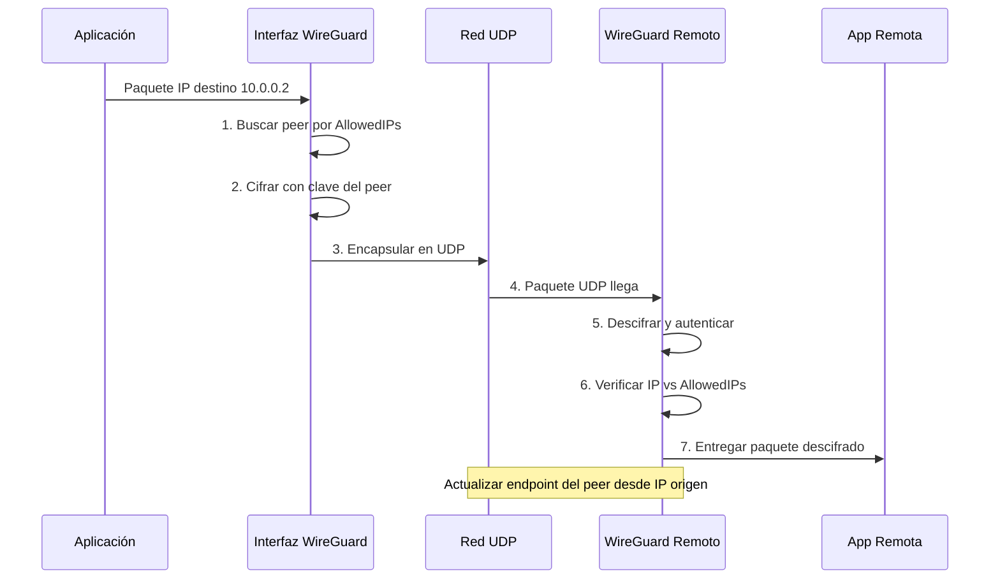

<div v-click class="mt-4 p-3 bg-purple-900/20 border border-purple-800 rounded text-sm">
  <span class="text-purple-400 font-bold">Roaming integrado:</span> WireGuard actualiza el endpoint de cada peer al recibir un paquete autenticado. Ambos lados pueden cambiar de IP sin reconfiguración.
</div>

---

# WireGuard: Por qué es tan rápido

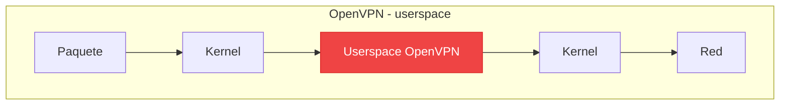

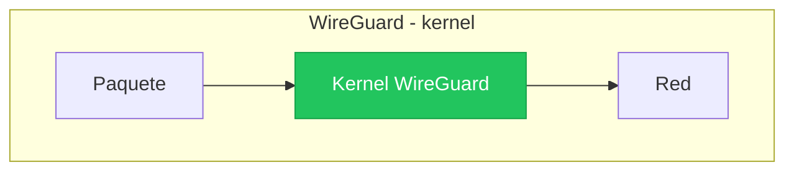

<v-clicks>

- **Sin context switches**: todo ocurre dentro del kernel, sin copiar datos al userspace
- **Primitivas rápidas**: ChaCha20 y Poly1305 son eficientes en CPUs ARM y x86 sin AES-NI
- **Interfaz de red nativa**: WireGuard se presenta como `wg0`, una interfaz estándar del sistema operativo

</v-clicks>

---

# Arquitectura de Tailscale

## Control Plane vs Data Plane

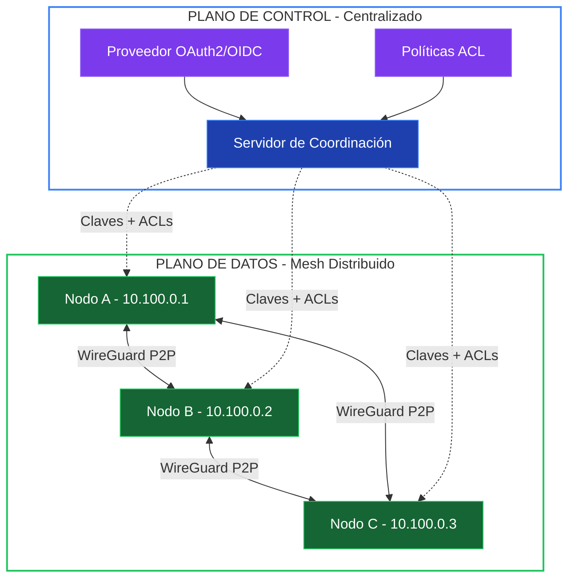

<div class="grid grid-cols-2 gap-4 mt-2">
  <div v-click class="p-3 bg-blue-900/20 border border-blue-800 rounded" style="font-family: 'Geist Mono', monospace; font-size: 0.75rem;">
    Solo distribuye claves públicas y políticas. Nunca toca los datos. Si cae, las conexiones existentes siguen funcionando.
  </div>
  <div v-click class="p-3 bg-green-900/20 border border-green-800 rounded" style="font-family: 'Geist Mono', monospace; font-size: 0.75rem;">
    <span class="text-green-400 font-bold">Plano de Datos:</span> Conexiones WireGuard directas peer-to-peer. El tráfico nunca pasa por Tailscale. Cifrado extremo a extremo.
  </div>
</div>

---

# Intercambio de claves: El buzón compartido

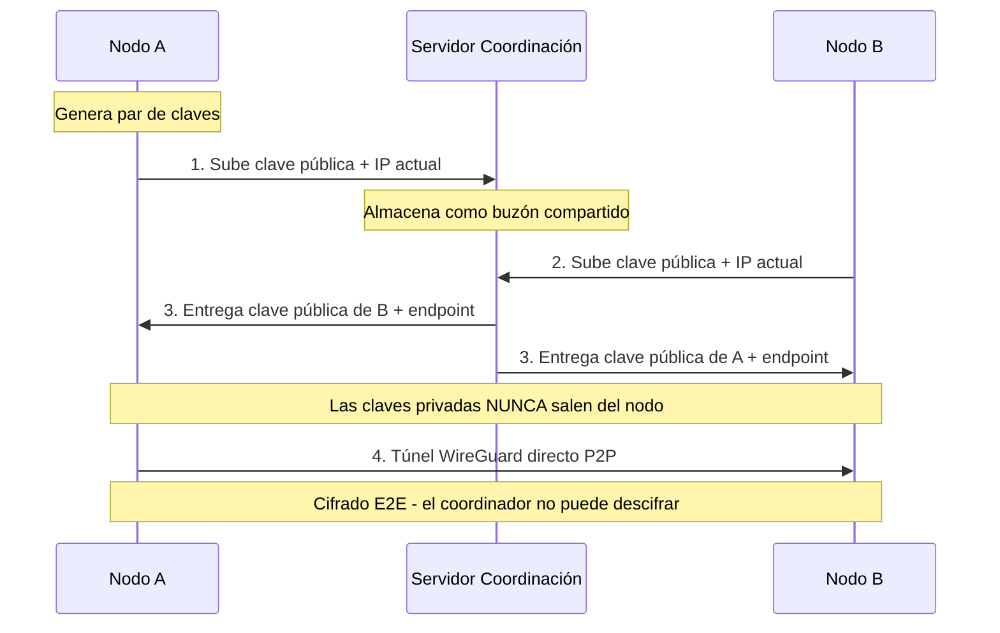

<div v-click class="mt-4 p-3 bg-yellow-900/20 border border-yellow-800 rounded text-sm">
  <span class="text-yellow-400 font-bold">Principio clave:</span> Tailscale externaliza la autenticación a proveedores OAuth2/OIDC (Google, Microsoft, GitHub). Esto minimiza la información personal que almacena.
</div>

---

# NAT Traversal: Conectando lo imposible

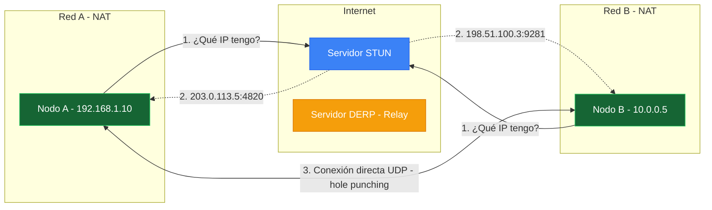

<div class="grid grid-cols-3 gap-3 mt-4 text-sm">
  <div v-click class="p-3 bg-blue-900/20 border border-blue-800 rounded">
    <div class="text-blue-400 font-bold mb-1">Paso 1: STUN</div>
    Cada nodo pregunta a un servidor STUN su IP pública y puerto.
  </div>
  <div v-click class="p-3 bg-green-900/20 border border-green-800 rounded">
    <div class="text-green-400 font-bold mb-1">Paso 2: Hole Punching</div>
    Ambos envían paquetes UDP simultáneamente, perforando sus NATs.
  </div>
  <div v-click class="p-3 bg-yellow-900/20 border border-yellow-800 rounded">
    <div class="text-yellow-400 font-bold mb-1">Paso 3: DERP</div>
    Si UDP está bloqueado, servidores DERP retransmiten tráfico cifrado.
  </div>
</div>

---

# DERP: Designated Encrypted Relay for Packets

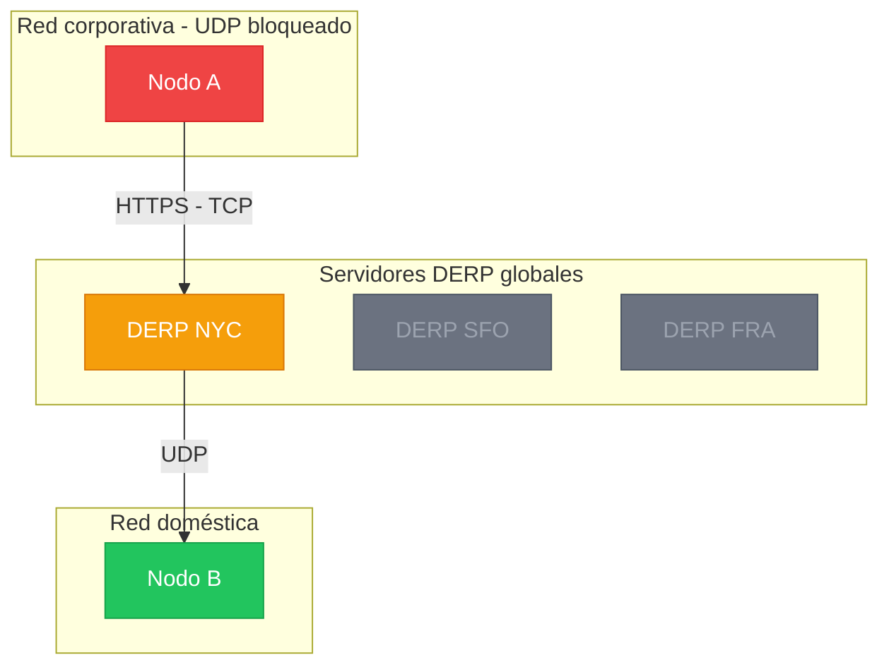

<v-clicks>

- **¿Cuándo se usa?** Redes restrictivas que bloquean UDP. DERP usa HTTPS (TCP) como transporte
- **¿Es seguro?** Sí. Las claves privadas nunca salen del nodo.
- **Enrutamiento inteligente** Los paquetes van al DERP más cercano al destinatario, no al emisor

</v-clicks>

---

# ACLs: Seguridad Distribuida

<div class="grid grid-cols-2 gap-4 lg:gap-6 mt-4 w-full max-w-full items-start text-left">

<div class="min-w-0 flex flex-col gap-2">

<h3 class="text-sm font-semibold text-gray-100 shrink-0">Modelo tradicional</h3>

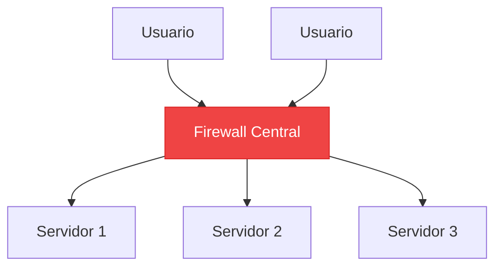

<p class="mt-1 p-2 bg-red-900/20 border border-red-800 rounded text-xs leading-snug max-w-max">
Si el firewall cae, todo queda expuesto.
</p>

</div>

<div class="min-w-0 flex flex-col gap-2">

<h3 class="text-sm font-semibold text-gray-100 shrink-0">Modelo Tailscale</h3>

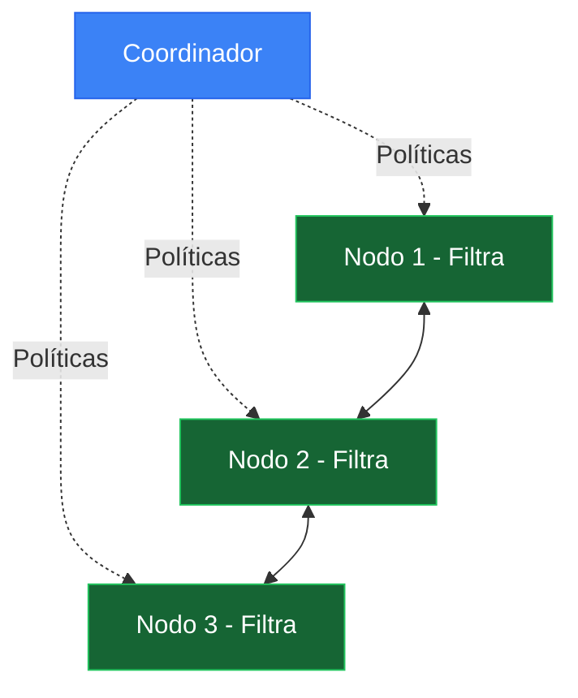

<p class="mt-1 p-2 bg-green-900/20 border border-green-800 rounded text-xs leading-snug max-w-max">
Cada nodo aplica reglas al descifrar. Sin la regla "accept", se rechaza.
</p>

</div>

</div>

---

# MagicDNS y Tailnet

<div class="grid grid-cols-2 gap-8 mt-6">
  <div>
    <v-clicks>
    <div class="mb-4 p-4 rounded-lg border border-gray-800 bg-gray-900/50">
      <div class="text-blue-400 font-bold mb-2">MagicDNS</div>
      <div class="text-sm text-gray-400">
        En vez de recordar <code>100.64.0.3</code>, simplemente se usa <code>mi-laptop</code> o <code>mi-laptop.tail12345.ts.net</code>.
      </div>
    </div>
    <div class="mb-4 p-4 rounded-lg border border-gray-800 bg-gray-900/50">
      <div class="text-purple-400 font-bold mb-2">Tailnet</div>
      <div class="text-sm text-gray-400">
        Nuestra red privada virtual. Cada cuenta tiene un dominio único <code>*.ts.net</code>.
      </div>
    </div>
    <div class="mb-4 p-4 rounded-lg border border-gray-800 bg-gray-900/50">
      <div class="text-green-400 font-bold mb-2">HTTPS automático</div>
      <div class="text-sm text-gray-400">
        Certificados TLS para dominios <code>*.ts.net</code> sin configuración manual.
      </div>
    </div>
    </v-clicks>
  </div>
  <div v-click>
    <div class="p-4 rounded-lg border border-gray-800 bg-gray-900/80" >
      <div class="text-gray-500 mb-2"># Acceder a servicios</div>
      <div class="mb-3">
        <span class="text-gray-500">$</span> <span class="text-green-400">ssh</span> mi-servidor
      </div>
      <div class="mb-3">
        <span class="text-gray-500">$</span> <span class="text-green-400">curl</span> http://pi-hole:8080/admin
      </div>
      <div class="mb-3">
        <span class="text-gray-500">$</span> <span class="text-green-400">psql</span> -h db-prod postgres
      </div>
      <div class="text-gray-600 mt-4 border-t border-gray-700 pt-2">
        Sin IPs, sin puertos públicos, sin DNS manual
      </div>
    </div>
  </div>
</div>

---

# Casos de Uso Reales

## Caso 1: Homelab accesible desde cualquier lugar

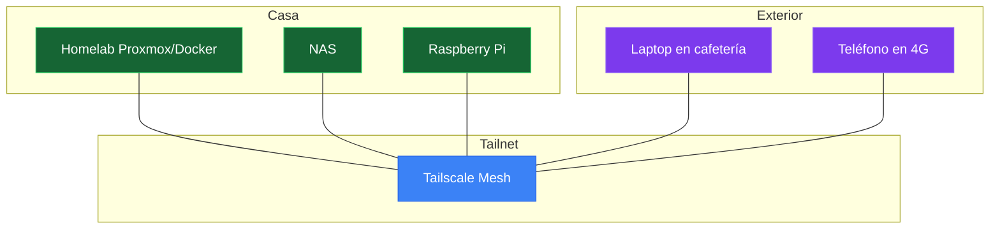

<v-clicks>

- **Sin abrir puertos**: no se necesita port forwarding. NAT traversal se encarga de eso
- **Acceso seguro al NAS**: archivos, fotos y backups cifrados E2E desde cualquier lugar
- **AdBlocker en todos lados**: bloqueo de publicidad usando Pi-hole/Adguard Home a nivel de red, no de navegador

</v-clicks>

---

# Caso 2: Desarrollo Multi-Cloud

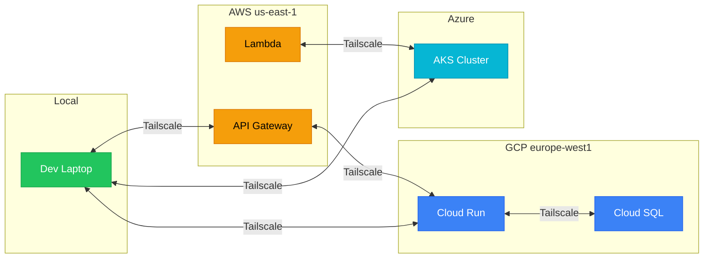

---

# Caso 3: IoT y Dispositivos Embebidos

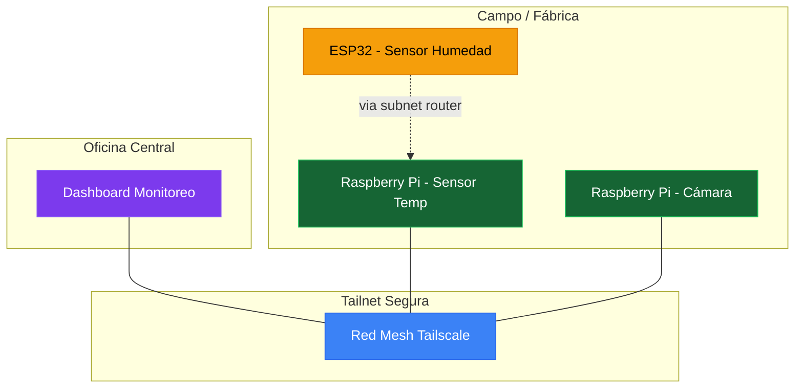

---

# Recursos

- Presentación:
  - Web: https://tailscale-udi.pulgueta.com
  - GitHub: https://github.com/pulgueta/tailscale-lecture
- Tailscale:
  - Web: https://tailscale.com
  - GitHub: https://github.com/tailscale/tailscale
- Wireguard:
  - Web: https://www.wireguard.com
  - GitHub (mirrors): https://github.com/orgs/WireGuard/repositories
- https://www.paloaltonetworks.com/cyberpedia/what-is-a-vpn-concentrator
- https://tailscale.com/learn/understanding-mesh-vpns
- https://tailscale.com/blog/how-tailscale-works
